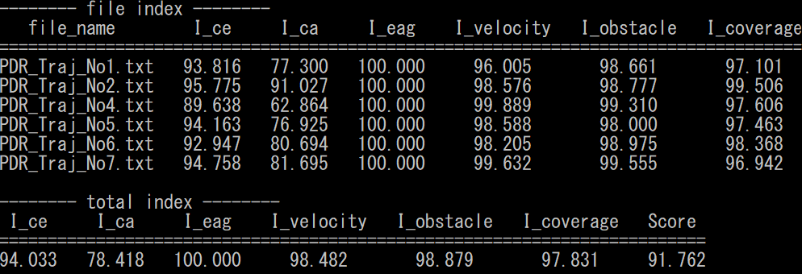
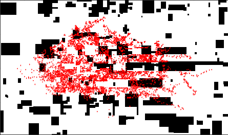

<div align="center">
<a href=https://unit.aist.go.jp/harc/xDR-Challenge-2020/>
</a>
</div>

# xDR-Challenge-2020-evaluation
[日本語版(Japanese) README](README_JP.md)  
People who are involved in indoor positioning technology can calculate their competition's index for xDR Challenge 2020.  
This evaluation tool is to show the example of usage of indicators for the people who do not join the competition and guarantee the competition faireness.  
The indicator and requiremet that are necessary for evaluating index are calculated by [LTS-benchmark-tool](https://github.com/PDR-benchmark-standardization-committee/LTS-benchmark-tool)   
If you want see the detail of indicator and requirement calculation, see [LTS-benchmark-tool](https://github.com/PDR-benchmark-standardization-committee/LTS-benchmark-tool)   

| **Index**  | **Corresspond Indicator and Requirement**| **Description**                                          |
 ---         |---                                 |---                                       
| I_ce       | Circular Error (CE)                | Check the distance between trajection and correct point        |
| I_ca       | Circular Accuracy (CA)             | Check the error distribution in each area                      | 
| I_eag      | Error Accumulation Gradient (EAG)  | Check trajection that is far from correction points is accurate|
| I_velocity | Requirement for Moving Velocity    | Check trajection velocity is within human walking speed        |
| I_obstacle | Requirement for Obstacle Avoidance | Check trajecion points exists obstacle human cannot enter      |

## Example of Evaluation Result
You can calculate each trajection index for xDR Challenge 2020 competition 
<div align="cenetr">

</div>


## Requirement
```
python==3.6.10  
numpy==1.18.1  
pandas==1.0.1  
texttable==1.6.2  
tqdm==4.43.0  
opencv-python==4.2.0.34  
matplotlib==3.1.3 
scipy==1.4.1
seaborn==0.10.1  
```

## Description of Files

| **Filename**           | **Description**                                                                    |
 ---                     |---                                       
| main.py                | Execute evaluation script for index                                                | 
| index_evaluation.py    | Module for calculating index                                                       |
| dataloader.py          | Module for loading ground truth data, estimation data                              |
| utils.py               | General functions to create result directory, stdout result                        |
| index_utils.py         | Specific functions to process index                                                |
| index_weights.ini      | Index weights to evaluate competition score                                        |
| demo_area_weights.ini  | Demo estimation's area weights                                                     |
| requirements.txt       | Python library package version                                                     |
| data_config_xDR_Challenge_2020_sample_data.ini| data configuration file to evaluate sample data for xDR Challenge 2020 competition|

## Usage
### Step.1 Install
```
git clone --recursive https://github.com/PDR-benchmark-standardization-committee/xDR-Challenge-2020-evaluation
cd xDR-Challenge-2020-evaluation
pip install -r requirements.txt
```

### Step.2 Place estimation files
Place each track's estimation files at [estimatiion_folder]/PDR and [estimation_folder]/VDR respectively.  
If you want to evaluate demo estimation files, you don't need to prepare estimation files.
```
xDR-Challenge-2020-evaluation/
    ├ estimation_folder (demo_estimation)/
    │       └ VDR/[**VDR esimation files**]
    │       └ PDR/[**PDR estimation files**]
    │
    ├ groud_truth_folder (demo_ground_truth)/
    │       └ [**data config ini file**]
    │
    ├ main.py
    ├ index_evaluation.py
    ├ index_utils.py
    ├ utils.py
    ├ dataloader.py
    ├ index_weights.ini
    ├ demo_area_weights.ini
    ├ requirements.txt
    └ README.md
```
### Step.3 Place directory structure configuration 
You need to prepare configuration file that correspond to ground truth folder to evaluate.  
If you want to use your own groud truth file, please edit [demo_ground_truth/demo_data_config.ini] and place at groud truth folder.  
Demo groud truth configuration file is already prepared, so you don't need edit configuration file,  
just keep next step.

```
; Folder name of answer data
[ANSWER]
ground_truth_dname = 'demo_ground_truth'

[PDR]
; Folder name of ground truth files for evaluation
map_dname = 'PDR_Map'
ans_dname = 'PDR_Ans'
ref_dname = 'PDR_Ref'
bup_dname = 'PDR_Bup'

; File name of ground truth files for evaluation
map_image_fname = 'Map_image.bmp'
map_size_fname = 'Map_size.csv'
area_fname = 'Area.csv'
ref_fname = 'PDR_Ref_No{}.csv'
ans_fname = 'PDR_Ans_No{}.csv'
bup_info_fname = 'PDR_Bup_info_No{}.csv'

[VDR]
; Please write folder and file name for evaluation as [PDR]
```

### Step.4 Evaluation
You need to select estimation and ground truth folder path for evaluation 
```
python main.py [estimation_path] [ground_truth_path]
```

If you want to see the demo estimation score results, you just execute following script
```
python main.py demo_estimation demo_ground_truth
```

Results are saved at estimation files folder.  
If you execute the evaluation for demo_estimation files, the score is saved at following folder.
```
demo_estimation/
  └ VDR/
    └ results/
       ├ indicator
       └ index
         ├ file_index.csv
         └ total_index.csv
```


## Optional Arguments
### 1. Select track
You can select track to evaluate.  
In default, both PDR and VDR score are calculated.
```
python main.py demo_estimation demo_ground_truth --VDR --PDR
```

### 2. Select files
You can choose specific estimation file to evaluate index.  
If you execute following script, [demo_estimation/VDR/VDR_Traj_No2.txt] index are evaluated.
```
python main.py demo_estimation demo_ground_truth --VDR --file VDR_Traj_No2.txt 
```

### 3. Select index
You can select competition index to calculate.  
In default, all index are calculated.
```
python main.py demo_estimation demo_ground_truth --I_ce --I_ca --I_eag --I_velocity --I_obstacle
```

### 4. Select index weights  
You can change index weights to calculate competition score in index_weights.ini  
Default index weights is below.
```
<config.ini>
;weights for each index
[WEIGHTS]
I_ce = 0.20
I_ca = 0.20
I_eag = 0.20
I_velocity = 0.20
I_obstacle = 0.20
```

### 5. Select parameters

You can select percentile to calculate I_ce and I_eag.  
In default, 50 percentile is used.  
```
python main.py demo_estimation demo_ground_truth --CE_percentile 30 --EAG_percentile 75
```

You can select threshold velocity for I_velocity.  
In default, I_velocity is calculated by threshold 1.5 m/s.  
```
python main.py demo_estimation demo_ground_truth --velocity 1.8
```

You can select band width to calculate I_ca by Kernel Density Estimation  
If you do not select band_width, scipy default band widht is used.  
```
python main.py demo_estimation demo_ground_truth --band_width 1.4
```

In default, I_ca is caluculated by Kernel Density Estimation, you can switch to use 2D histgram.    
```
python main.py demo_estimation demo_ground_truth --CA_hist
```

### 6. Use pre-defined area weights
You can use pre-defined area weights to calculate I_ca.  
You need to prepare area weights configuration ini file.  
Please see configuration format at [demo_area_weights.ini].  
If you do not select area weights configuration file path,  
area weights are set as the ratio of each area's answer points for total area answer points.  
```
; demo_area_weights.ini
[VDR]
area1 = 0.3
area2 = 0.3
area3 = 0.4

[PDR]
area1 = 0.4
area2 = 0.6
```
Please select area weigths configuration path
```
python main.py demo_estimation demo_ground_truth --area_weights demo_area_weights.ini
```

## Demo Estimation Result
You can execute the evaluation tool and see the actual results by using demo estimation data.  
VDR_Traj_No2.txt  
  

```                                                 
(python36) $ python main.py demo_estimation --VDR
track: ['VDR']
index: ['I_ce', 'I_ca', 'I_eag', 'I_velocity', 'I_obstacle']
VDR_Traj_No1.txt evaluation progress...
100%|█████████████████████████████████████| 9006/9006 [00:02<00:00, 3168.33it/s]
VDR_Traj_No2.txt evaluation progress...
100%|█████████████████████████████████████| 7868/7868 [00:01<00:00, 4276.67it/s]
VDR_Traj_No3.txt evaluation progress...
100%|█████████████████████████████████████| 8957/8957 [00:02<00:00, 3039.98it/s]
VDR_Traj_No4.txt evaluation progress...
100%|█████████████████████████████████████| 7716/7716 [00:01<00:00, 4169.47it/s]
VDR_Traj_No5.txt evaluation progress...
100%|█████████████████████████████████████| 9054/9054 [00:03<00:00, 2485.73it/s]
VDR_Traj_No6.txt evaluation progress...
100%|█████████████████████████████████████| 7718/7718 [00:02<00:00, 3726.62it/s]
-------- file index --------
   file_name        I_ce     I_ca     I_eag    I_velocity   I_obstacle
======================================================================
VDR_Traj_No1.txt   85.273   51.256   98.448      94.137       86.725  
VDR_Traj_No2.txt   77.126   53.816   94.461      98.081       90.180  
VDR_Traj_No3.txt   89.130   62.959   100.000     95.132       85.035  
VDR_Traj_No4.txt   89.409   63.069   11.275      97.564       91.464  
VDR_Traj_No5.txt   81.077   31.457   98.078      94.621       77.852  
VDR_Traj_No6.txt   90.279   28.713   97.878      94.545       91.440   

-------- total index --------
 I_ce     I_ca    I_eag    I_velocity   I_obstacle   Score 
===========================================================
85.382   48.545   83.356     95.680       87.116     80.016 

-------- file indicator --------
   file_name       CE50     CA     EAG50   requirement_velocity   requirement_obstacle
======================================================================================
VDR_Traj_No1.txt   5.271   4.874   0.080          0.571                  0.133        
VDR_Traj_No2.txt   7.633   4.618   0.158          0.264                  0.098        
VDR_Traj_No3.txt   4.152   3.704   0.029          0.568                  0.150        
VDR_Traj_No4.txt   4.071   3.693   1.780          0.365                  0.085        
VDR_Traj_No5.txt   6.488   6.854   0.087          0.611                  0.221        
VDR_Traj_No6.txt   3.819   7.129   0.091          0.529                  0.086         

-------- total indicator --------
CE50     CA     EAG50   requirement_velocity   requirement_obstacle
===================================================================
5.239   5.145   0.371          0.484                  0.129         
```

## Evaluation for Competition Sample Data 
If you want to execute evaluation to sample data for xDR Challenge 2020,  
please place [data_config_xDR_challenge_2020_sample_data.ini] at sample data groud truth folder.  
[**NOTE**]:   
Sample data's reference point is regarded as answer point and BUP information is not included in sample data.    
Therefore, we cannot calculate EAG in default.  
Besides, map area data is not included in sample data, so CA is calculated by whole area.  


```
xDR-Challenge-2020-evaluation/
    ├ sample data estimation folder/
    │       └ VDR/[**VDR esimation files**]
    │       └ PDR/[**PDR estimation files**]
    │
    ├ [sample data ground truth folder]/
    │       └ [data_config_xDR_challenge_2020_sample_data.ini]
    │
    ├ main.py
    ├ index_evaluation.py
    ├ index_utils.py
    ├ utils.py
    ├ dataloader.py
    ├ index_weights.ini
    ├ requirements.txt
    └ README.md
```

## Licence
Copyright (c) 2020 Satsuki Nagae and PDR benchmark standardization committee.  
xDR-Challenge-2020-evaluation is open source software under the [MIT license](LICENSE).  

## Reference 
- [xDR Challenge in industrial Scenario in 2020](https://unit.aist.go.jp/harc/xDR-Challenge-2020/)  
- [Ryosuke Ichikari, Katsuhiko Kaji, Ryo Shimomura, Masakatsu Kourogi, Takashi Okuma, Takeshi Kurata: Off-Site Indoor Localization Competitions Based on Measured Data in a Warehouse, Sensors, vol. 19, issue 4, article 763, 2019.](https://www.mdpi.com/1424-8220/19/4/763/htm#)
