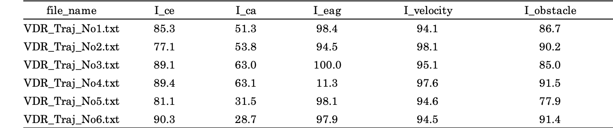

<div align="center">
<a href=https://unit.aist.go.jp/harc/xDR-Challenge-2020/>
 </a>
</div>

# xDR-Challenge-2020-evaluation
屋内測位に関わる人を対象とした、xDR Challenge 2020コンペティションで使われる指数の計算を行えるツールです。  
本ツールの目的は評価指標の使用例としての指数を実際に計算できることと、コンペの評価の透明性を高めることです。  
指標と必要条件はコンペの指数を計算するために必要な値で、[LTS-benchmark-tool](https://github.com/PDR-benchmark-standardization-committee/LTS-benchmark-tool/tree/xDR-Challenge-2020)を用いて計算されます。  
指標と必要条件の具体的な計算内容を見たい場合は、[LTS-benchmark-tool](https://github.com/PDR-benchmark-standardization-committee/LTS-benchmark-tool/tree/xDR-Challenge-2020)をご覧ください。  
以下が、計算可能な指数の概要と、対応する指標と必要条件になります

| **指数**   | **対応する指標と必要条件**                       | **概要**                                                    |
 ---         |---                                                 |---                                       
| I_ce       | 誤差絶対量: CE (Circular Error)                     | 正解座標と時間的最近傍の軌跡の距離が近いか評価             |
| I_ca       | 誤差分布偏移: CA (Circular Accuracy)                | 地図上のエリアごとの正解座標との誤差の分布を評価            | 
| I_eag      | 誤差累積速度: EAG (Accumulation Gradient)           | 位置補正のための座標からの誤差の累積スピードを評価          |
| I_velocity | 移動速度基準: Requirement for Moving Velocity       | 軌跡の速度が人間の歩行速度(1.5 m/s)以下であるか評価        |
| I_obstacle | 軌跡経路基準: Requirement for Obstacle Avoidance    | 地図上の軌跡が人間が侵入できない障害物を通過していないか評価 |
| I_coverage | 軌跡提出率基準: Requirement for Trajectory Coverage | 正解値の各時刻と軌跡の各時刻を比較し軌跡の提出割合を評価     |

## 評価結果例
下表のようなxDR Challenge 2020 のコンペティションで使用される指数の値を各推定軌跡ごとに求めることが可能です。
<div align="cenetr">

</div>


## 必要条件
```
python==3.6.10  
numpy==1.18.1  
pandas==1.0.1  
texttable==1.6.2  
tqdm==4.43.0  
opencv-python==4.2.0.34  
matplotlib==3.1.3 
scipy==1.4.1
seaborn==0.10.1  
```

## ファイルの概要

| **ファイル名**         | **概要**                                                                 |
 ---                     |---                                       
| main.py                | 評価実行用スクリプト                                                     | 
| index_evaluation.py    | 指数計算モジュール                                                       |
| dataloader.py          | 正解データ, 推定軌跡読み込みモジュール                                   |
| utils.py               | フォルダ作成、結果出力など汎用的な処理をまとめたスクリプト               |
| index_utils.py         | 指数を扱うための関数をまとめたスクリプト                                 |
| index_weights.ini      | コンペスコアを計算するための指数の重みの設定ファイル                     |
| demo_area_weights.ini  | デモ推定軌跡用のエリア重み設定ファイル                                   |
| requirements.txt       | Pythonの必要ライブラリのバージョンをまとめたファイル                     |
| data_config.ini        | xDR Challenge 2020 サンプルデータを読み込むための設定ファイル|

## 使用方法
### Step.1 インストール
```
git clone --recursive https://github.com/PDR-benchmark-standardization-committee/xDR-Challenge-2020-evaluation
cd xDR-Challenge-2020-evaluation
pip install -r requirements.txt
```

### Step.2 推定ファイルを配置
PDR, VDRの推定軌跡ファイルをそれぞれ[estimatiion_folder]/PDR, [estimation_folder]/VDRに配置してください。  
デモデータの評価を行いたい場合、ご自身の推定軌跡ファイルを用意する必要はありません。  

```
xDR-Challenge-2020-evaluation/
    ├ estimation_folder/
    │       ├ VDR/
    |       |  └ VDR_Traj_No*.txt [**VDR esimation files**]
    |       |
    │       └ PDR/
    |          └ PDR_Traj_No*.txt [**PDR esimation files**]
    │
    ├ groud_truth_folder/
    |       ├ BLE_Beacon/
    |       |  └ BLE_info.csv
    |       |
    |       ├ VDR_ALIP/
    |       |  └ VDR_ALIP_info_No*.csv
    |       |
    |       ├ VDR_Ans/
    |       |  └ VDR_Ans_No*.csv
    |       |
    |       ├ VDR_Map/
    |       |  ├ Map_image.bmp
    |       |  ├ Map_size.csv
    |       |  └ VDR_Area.csv
    |       |
    |       ├ VDR_Module/
    |       |  └ VDR_Sens_No*.txt
    |       |
    |       ├ VDR_Ref/
    |       |  └ VDR_Ref_No*.csv
    |       |
    |       ├ PDR_ALIP/
    |       |  └ PDR_ALIP_info_No*.csv
    |       |
    |       ├ PDR_Ans/
    |       |  └ PDR_Ans_No*.csv
    |       |
    |       ├ PDR_Map/
    |       |  ├ Map_image.bmp
    |       |  ├ Map_size.csv
    |       |  └ PDR_Area.csv
    |       |
    |       ├ PDR_Module/
    |       |  └ PDR_Sens_No*.txt
    |       |
    |       ├ PDR_Ref/
    |       |  └ PDR_Ref_No*.csv
    |       |
    │       └ data_config.ini
    │
    ├ main.py
    ├ index_evaluation.py
    ├ index_utils.py
    ├ utils.py
    ├ dataloader.py
    ├ index_weights.ini
    ├ demo_area_weights.ini
    ├ requirements.txt
    └ README.md
```
#### VDR_Traj_No*.txt, PDR_Traj_No*.txtの構成
軌跡ファイルの中身はカンマ区切りで以下のような構成となります。  
※軌跡ファイル内にヘッダーは含みません。  
| unixtime | x[m] | y[m] |
|---       |---   |---   |

### Step.3 正解値データのディレクリ構造を記載した設定ファイルを用意
正解データを読み込むために、正解値データのディレクトリ名、  
ファイル名を記載した設定ファイルを準備する必要があります。  
ご自身の用意した正解データを利用する際は、groud_truth_folderのフォルダにあるdata_config.iniファイルを  
ご自身の正解データに合わせて修正し、正解データのディレクトリに配置してください。  
以下のような設定ファイルをご自身の正解値データに合わせて作成してください。  
```
; 正解値データフォルダ名
[ANSWER]
ground_truth_dname = 'groud_truth_folder'

[PDR]
map_dname = 'PDR_Map'
ans_dname = 'PDR_Ans'
ref_dname = 'PDR_Ref'
ALIP_dname = 'PDR_Bup'
BLE_dname = 'BLE_Beacon'

map_image_fname = 'Map_image.bmp'
map_size_fname = 'Map_size.csv'
area_fname = 'PDR_Area.csv'
ref_fname = 'PDR_Ref_No{}.csv'
ans_fname = 'PDR_Ans_No{}.csv'
ALIP_info_fname = 'PDR_Bup_info_No{}.csv'
BLE_info_fname = 'BLE_info.csv'

map_obstacle_color = 'gray'
map_trajectory_color = 'green'
map_ref_color = 'orange'
map_ble_color = 'blue'

map_trajectory_size = '0.2'
map_ref_size = '0.3'
map_ble_size = '2'
map_grid = 'False'

[VDR]
; PDRと同様にディレクトリ名・ファイル名を記載
```
デモデータの評価を行いたい場合、設定ファイルが既にデモ用正解値データのフォルダ内に配置されていますので、  
設定ファイルを用意する必要はありません。  

### Step.4 評価の実行
評価を行う推定軌跡と正解データのフォルダのパスをコマンドライン引数に入力する必要があります。
```
python main.py [estimation_path] [ground_truth_path]
```
デモデータの評価を実行したい場合は、以下のスクリプトを実行してください
```
python main.py estimation_folder groud_truth_folder
```

指数と、対応する指標と必要条件の評価結果が推定軌跡のフォルダ内に保存されます。  
デモデータの評価を行った場合、以下のパスに結果が保存されます。

```
estimation_folder/
  | VDR/
  | └ result/
  |    ├ indicator
  |    | ├ CA
  |    | | ├ Traj_No*_area*_CA.png
  |    | | └ Traj_No*_CA.csv
  |    | |
  |    | ├ CE
  |    | | ├ CE_total_cumulative_sum.csv
  |    | | ├ CE_total_cumulative_sum.png
  |    | | ├ CE_total_histgram.png
  |    | | ├ Traj_No*_CE.csv
  |    | | ├ Traj_No*_CE_debug.csv
  |    | | └ Traj_No*_CE_histgram.png
  |    | |
  |    | ├ EAG
  |    | | ├ EAG_total_cumulative_sum.csv
  |    | | ├ EAG_total_cumulative_sum.png
  |    | | ├ EAG_total_histgram.png
  |    | | ├ Traj_No*_EAG.csv
  |    | | ├ Traj_No*_EAG_debug.csv
  |    | | └ Traj_No*_EAG_histgram.png
  |    | |
  |    | ├ requirement_obstacle
  |    | | └ Traj_No*_obstacle.csv
  |    | |
  |    | ├ requirement_velocity
  |    | | └ Traj_No*_moving_velocity.csv
  |    | |
  |    | ├ Trajectory
  |    | | └ Tra_No*.png
  |    | |
  |    | ├ file_indicator.csv
  |    | └ total_indicator.csv
  |    |
  |    └ index
  |      ├ file_index.csv
  |      └ total_index.csv
  └ PDR/
    └result/ [***Almost the same as VDR result folder***]
```

## コマンドライン引数
以下のコマンドライン引数を追加することが可能となっています。

### 1. PDR, VDRの選択
PDR, VDR、どちらの評価を行うか選択することができます。  
引数なしの場合は、PDR, VDR両方とも評価されます。

```
python main.py estimation_folder groud_truth_folder --VDR --PDR
```

### 2. 評価するファイルを選択
特定の軌跡ファイルを指定して、評価するファイルを選択することができます。  
例えば、以下のようなコマンドライン引数で実行した場合、  
[estimation_folder/VDR/VDR_Traj_No1.txt]の評価が実行されます。

```
python main.py estimation_folder groud_truth_folder --VDR --file VDR_Traj_No1.txt 
```

### 3. 計算する指標・必要条件の選択
計算を実行したい指数を選択することができます。  
引数なしの場合は、全ての指数の計算が実行されます  

```
python main.py estimation_folder groud_truth_folder --I_ce --I_ca --I_eag --I_velocity --I_obstacle
```

### 4. スコア計算のための各指数の重みを選択
[index_weights.ini]ファイルを書き換えることで、  
コンペスコアを求めるための各指数の重みを指定することができます。
デフォルトの各指数の重みは以下のようになっています。  
```
<config.ini>
;weights for each index
[WEIGHTS]
I_ce = 0.25
I_ca = 0.20
I_eag = 0.25
I_velocity = 0.15
I_obstacle = 0.15
```

### 5. パラメータの選択

I_ce, I_eagで計算するパーセント点を指定することができます。  
引数なしの場合は50パーセント点の値が計算されます。  

```
python main.py estimation_folder groud_truth_folder --CE_percentile 30 --EAG_percentile 75
```

I_velocityで用いられる速度しきい値を指定することができます。  
引数なしの場合は、1.5 m/s がしきい値として用いられます。

```
python main.py estimation_folder groud_truth_folder --velocity 1.8
```

I_caの計算でのカーネル密度推定のバンド幅を指定することができます。  
バンド幅の指定がない場合は、scikit-learnのデフォルトのバンド幅が用いられます。
```
python main.py estimation_folder groud_truth_folder --band_width 1.4
```

I_caの計算を二次元ヒストグラムで行うように切り替えることが可能となっています。  
引数なしの場合は、scipyのデフォルトパラメータのカーネル密度推定によってCAが計算されます  

```
python main.py estimation_folder groud_truth_folder --CA_hist
```

### 6. 事前に指定したエリア重みを使用する
I_caの計算に用いるエリア重みに、ご自身で設定した値を指定することができます。  
その場合、エリア重みを記述した設定ファイルを用意する必要があります。  
エリア重みの設定ファイルを指定しなかった場合、  
各エリアに含まれる正解値の全正解値に対する割合が各エリアの重みとなります。  
エリア重みの設定ファイルはデモデータ用のエリア重み設定ファイルのように作成してください。  
```
; demo_area_weights.ini
[VDR]
area1 = 0.3
area2 = 0.3
area3 = 0.4

[PDR]
area1 = 0.4
area2 = 0.6
```

用意したエリア重みの設定フィアルのパスを指定してください。
```
python main.py estimation_folder groud_truth_folder --area_weights demo_area_weights.ini
```

## ライセンス
Copyright (c) 2020 Satsuki Nagae and PDR benchmark standardization committee.  
xDR-Challenge-2020-evaluation is open source software under the [MIT license](LICENSE).  

## 参考文献 
- [xDR Challenge in industrial Scenario in 2020](https://unit.aist.go.jp/harc/xDR-Challenge-2020/)  
- [Ryosuke Ichikari, Katsuhiko Kaji, Ryo Shimomura, Masakatsu Kourogi, Takashi Okuma, Takeshi Kurata: Off-Site Indoor Localization Competitions Based on Measured Data in a Warehouse, Sensors, vol. 19, issue 4, article 763, 2019.](https://www.mdpi.com/1424-8220/19/4/763/htm#)
